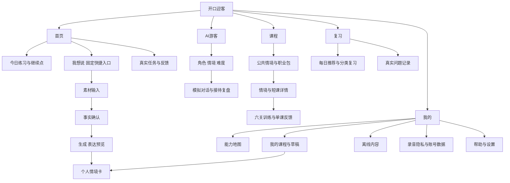
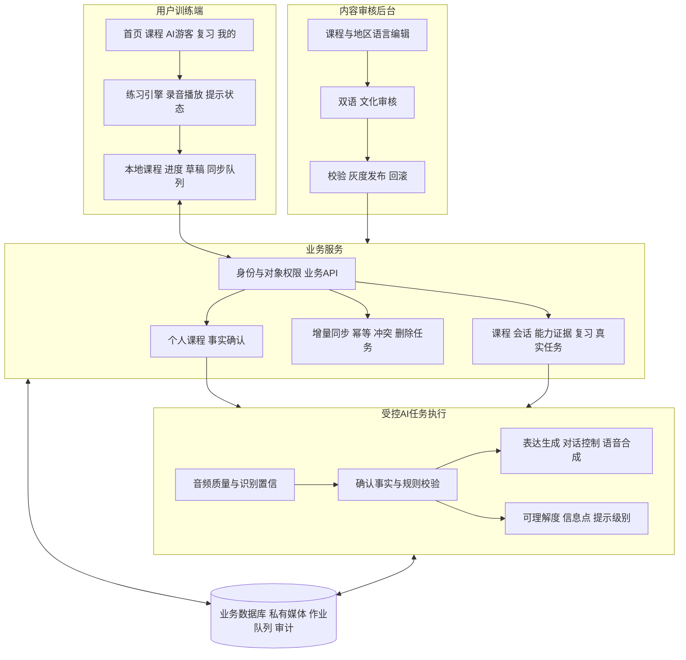
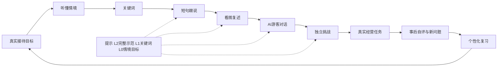
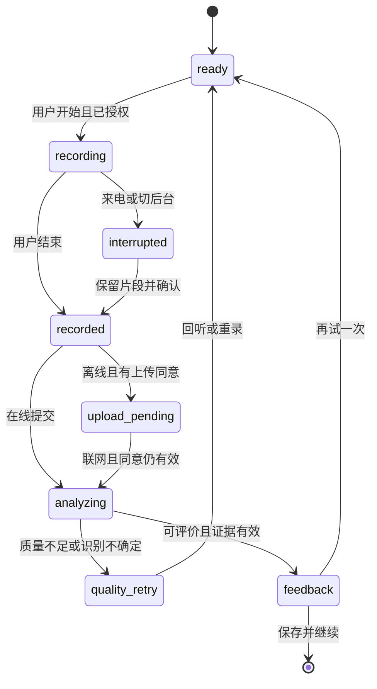
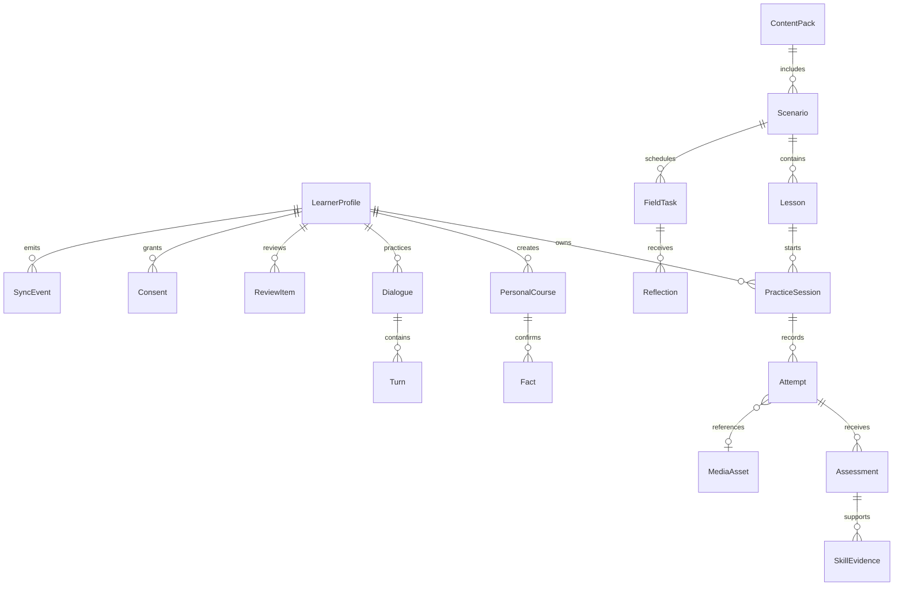

# 系统架构与学习闭环

## 用户端信息架构

```mermaid
flowchart TB
  App[开口迎客] --> Home[首页]
  App --> Courses[课程]
  App --> Tourist[AI游客]
  App --> ReviewTab[复习]
  App --> Me[我的]
  Home --> Continue[今日练习与继续点]
  Home --> Say[我想说 固定快捷入口]
  Home --> RealTask[真实任务与反馈]
  Courses --> CourseMap[公共情境与职业包]
  CourseMap --> Detail[情境与短课详情]
  Detail --> SixStages[六关训练与单课反馈]
  Tourist --> Role[角色 情境 难度]
  Role --> DialoguePage[模拟对话与接待复盘]
  Say --> Input[素材输入]
  Input --> Confirm[事实确认]
  Confirm --> Draft[生成 表达预览]
  Draft --> PersonalCard[个人情境卡]
  ReviewTab --> Queue[每日推荐与分类复习]
  ReviewTab --> NewIssue[真实问题记录]
  Me --> Skills[能力地图]
  Me --> Personal[我的课程与草稿]
  Personal --> PersonalCard
  Me --> Downloads[离线内容]
  Me --> Privacy[录音隐私与账号数据]
  Me --> Settings[帮助与设置]
```

## 系统逻辑架构

```mermaid
flowchart TB
  subgraph Client[用户训练端]
    UI[首页 课程 AI游客 复习 我的]
    Practice[练习引擎 录音播放 提示状态]
    Local[本地课程 进度 草稿 同步队列]
    UI --> Practice --> Local
  end
  subgraph Service[业务服务]
    API[身份与对象权限 业务API]
    Learning[课程 会话 能力证据 复习 真实任务]
    Personal[个人课程 事实确认]
    Sync[增量同步 幂等 冲突 删除任务]
    API --> Learning
    API --> Personal
    API --> Sync
  end
  subgraph AI[受控AI任务执行]
    Quality[音频质量与识别置信]
    Facts[确认事实与规则校验]
    Generate[表达生成 对话控制 语音合成]
    Assess[可理解度 信息点 提示级别]
    Quality --> Facts --> Generate
    Facts --> Assess
  end
  subgraph Admin[内容审核后台]
    Edit[课程与地区语言编辑]
    Review[双语 文化审核]
    Release[校验 灰度发布 回滚]
    Edit --> Review --> Release
  end
  Data[(业务数据库 私有媒体 作业队列 审计)]
  Local <--> API
  Personal --> AI
  Learning --> AI
  Service <--> Data
  AI <--> Data
  Release --> Service

```

## 学习闭环

```mermaid
flowchart LR
  Goal[真实接待目标] --> Listen[听懂情境]
  Listen --> Words[关键词]
  Words --> Repeat[短句跟说]
  Repeat --> Retell[看图复述]
  Retell --> Dialogue[AI游客对话]
  Dialogue --> Challenge[独立挑战]
  Challenge --> Task[真实经营任务]
  Task --> Reflection[事后自评与新问题]
  Reflection --> Review[个性化复习]
  Review --> Goal
  Hint[提示 L2完整示范 L1关键词 L0情境目标] -.-> Repeat
  Hint -.-> Retell
  Hint -.-> Dialogue
  Hint -.-> Challenge

```

## 录音评价状态

```mermaid
stateDiagram-v2
  [*] --> ready
  ready --> recording: 用户开始且已授权
  recording --> recorded: 用户结束
  recording --> interrupted: 来电或切后台
  interrupted --> recorded: 保留片段并确认
  recorded --> upload_pending: 离线且有上传同意
  recorded --> analyzing: 在线提交
  upload_pending --> analyzing: 联网且同意仍有效
  analyzing --> quality_retry: 质量不足或识别不确定
  analyzing --> feedback: 可评价且证据有效
  quality_retry --> ready: 回听或重录
  feedback --> ready: 再试一次
  feedback --> [*]: 保存并继续
```

## 核心数据关系

```mermaid
erDiagram
  LearnerProfile ||--o{ PracticeSession : owns
  ContentPack ||--o{ Scenario : includes
  Scenario ||--o{ Lesson : contains
  Lesson ||--o{ PracticeSession : starts
  PracticeSession ||--o{ Attempt : records
  Attempt ||--o{ Assessment : receives
  Assessment ||--o{ SkillEvidence : supports
  Attempt }o--o| MediaAsset : references
  LearnerProfile ||--o{ PersonalCourse : creates
  PersonalCourse ||--o{ Fact : confirms
  LearnerProfile ||--o{ Dialogue : practices
  Dialogue ||--o{ Turn : contains
  Scenario ||--o{ FieldTask : schedules
  FieldTask ||--o{ Reflection : receives
  LearnerProfile ||--o{ ReviewItem : reviews
  LearnerProfile ||--o{ Consent : grants
  LearnerProfile ||--o{ SyncEvent : emits
```
